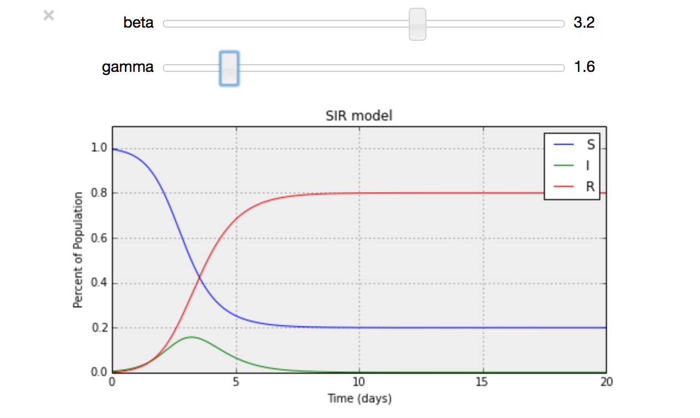
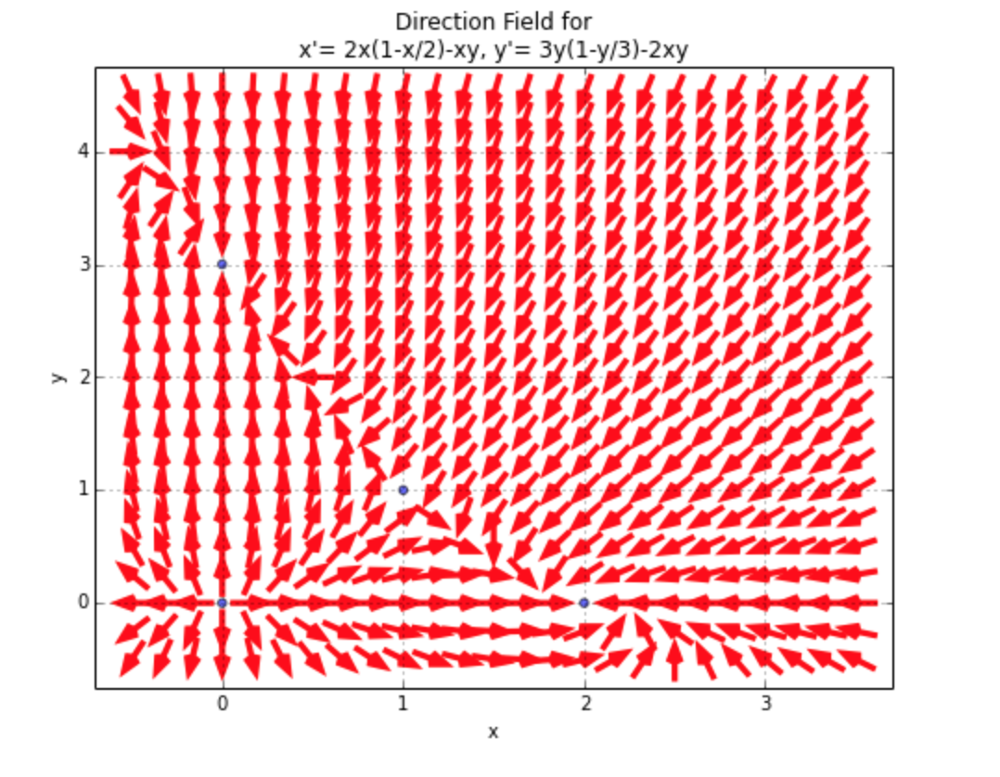
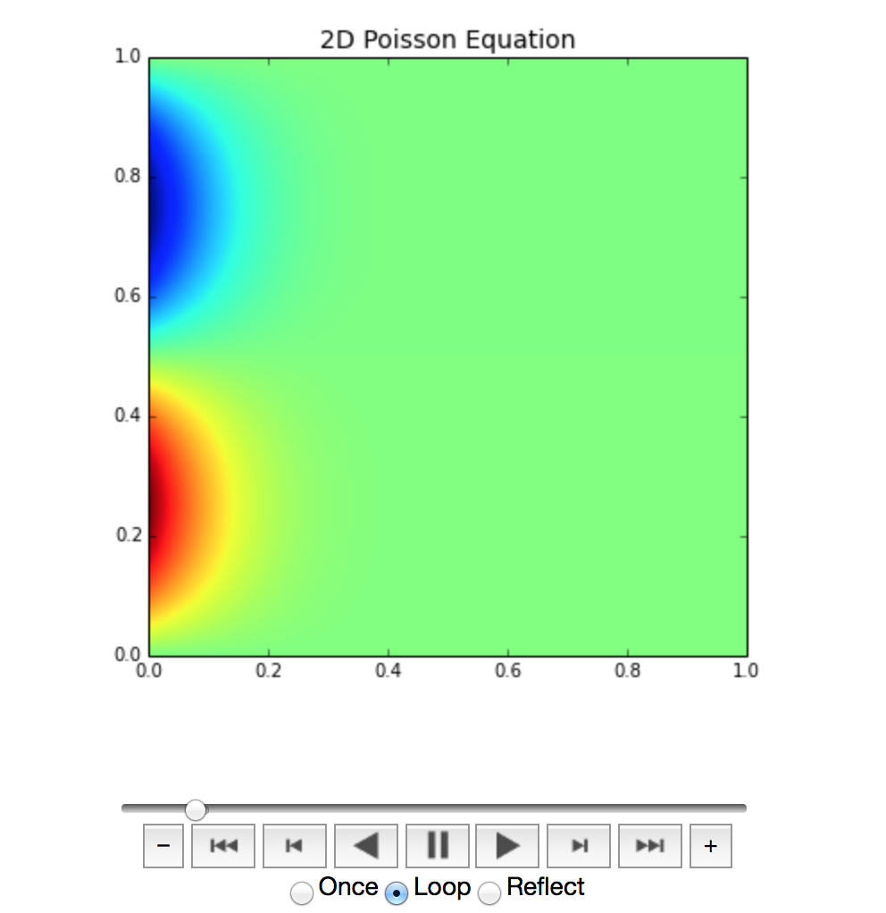
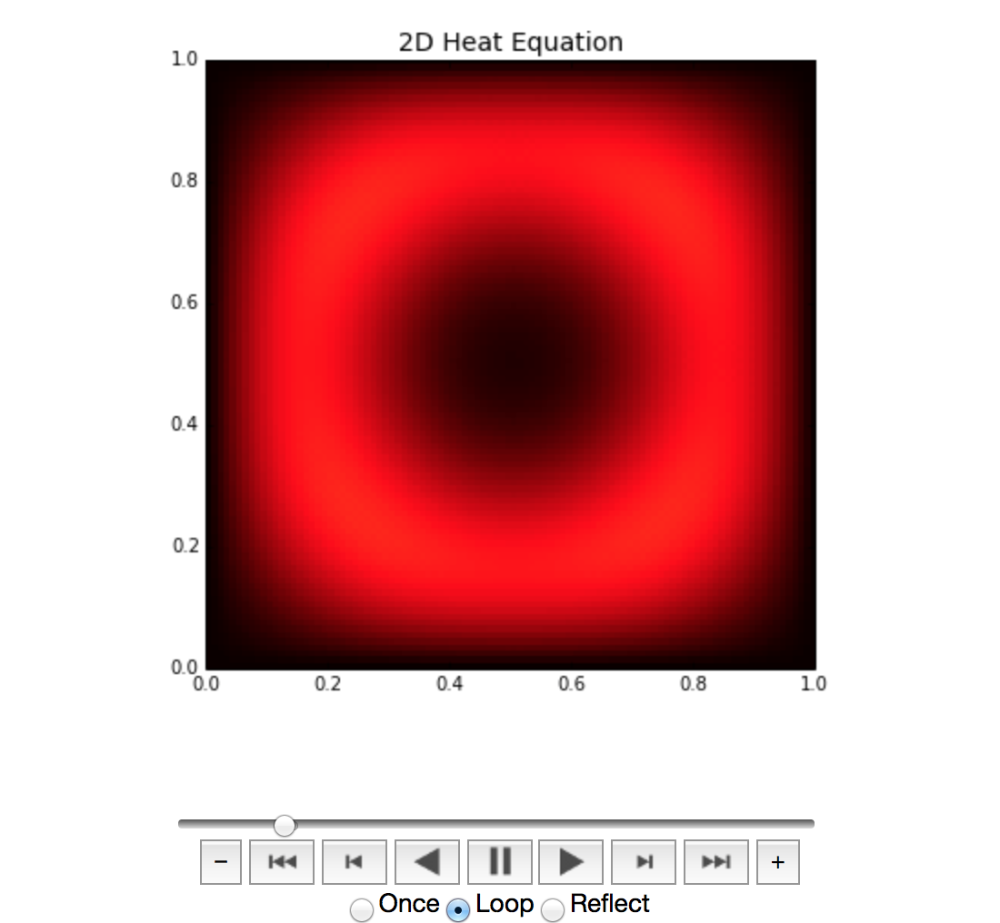
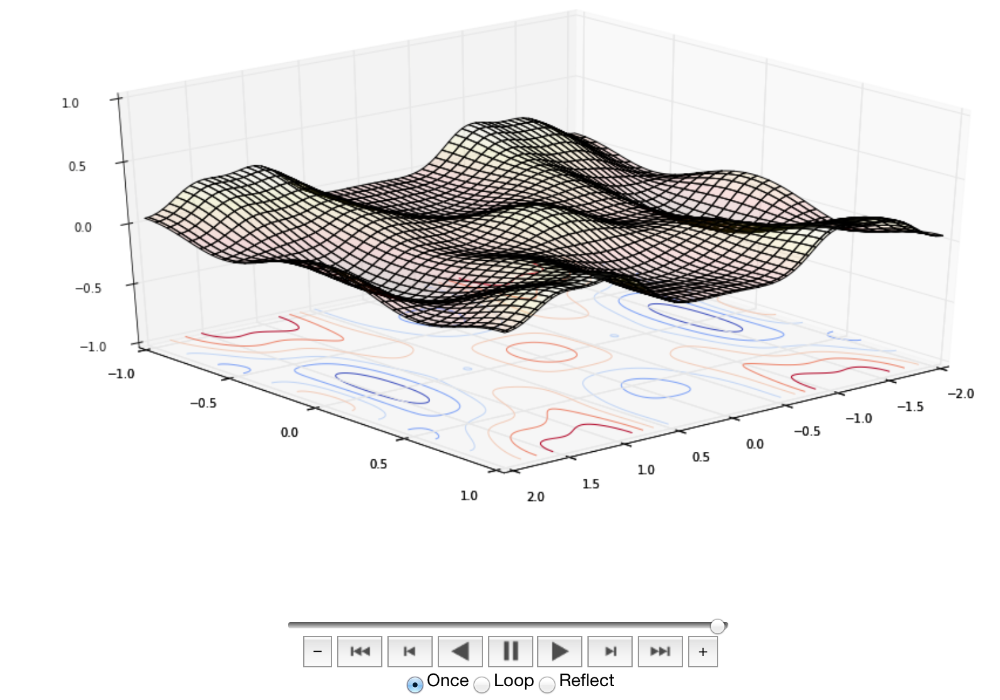
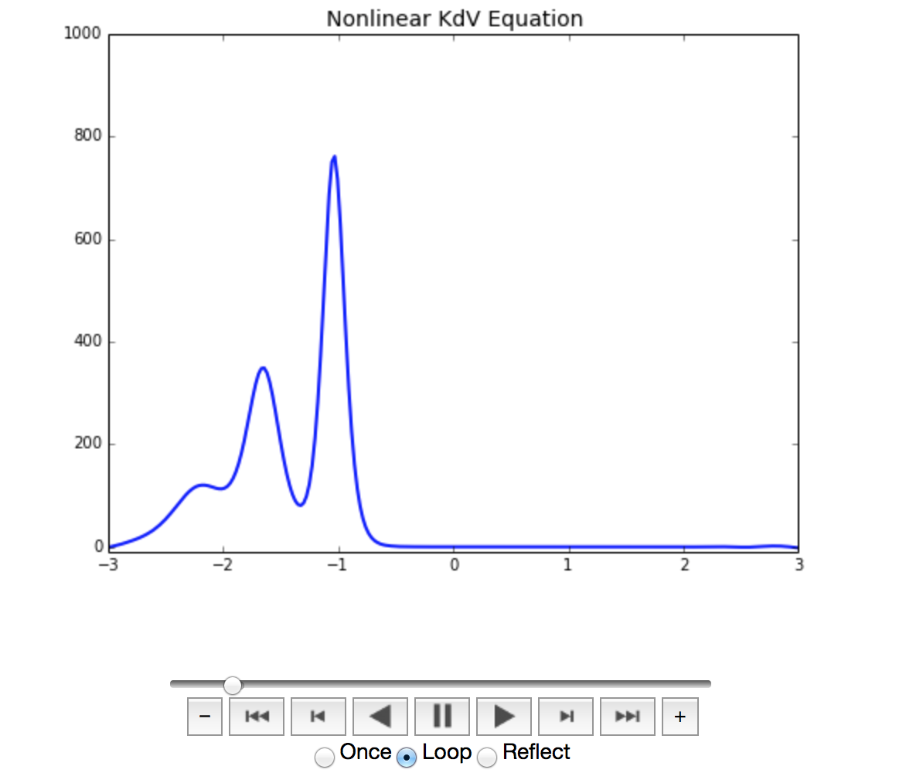

#On-line Laboratory for Dynamical Systems On IPython#

## Index
[Purpose of package]
avails ubiquitous on-line Lab for Dynamic systems, with minimal resources but un-limit gains.

To implement the platform, we use the following Python and IPython (notebook interface) as the user interface on the top of power Python computing environment. Sources can be re-used on Sage Notebook.

[Python Modules Requirement]
 
* <a href=“http://www.python.org”>Python - 2.7.x, 3.4.x</a>
* <a href=“www.scipy.org”>SciPy/NumPy</a>
* <a href=“matplotlib.org”>Matplotlib + <a href=“https://pypi.python.org/pypi/IVisual”>IVisual</a>
* <a href=“ipython.org”>IPython (2.+], <a href=“https://github.com/jakevdp/ipywidgets”>ipywidgets</a>, <a href=“https://github.com/jakevdp/JSAnimation”>JSAnimation</a>, <a href=“https://github.com/epmoyer/ipy_table”>ipy_table</a>
* <a href=“www.sympy.org”>SymPy</a>

[Topics]
- [Epidemic Model](DiffEq/0-Basics.ipynb), [Epidemic Model (HTML)](DiffEq/0-Basics.html)
- [Epidemic SIR Model](DiffEq/SIR.ipynb)

- [2D Dynamical Systems](DiffEq/2Dde.ipynb)

- [Greatest Indian Rope-Strick](Sim/index.ipynb)
   -  Double Pendulum: [IPyNB](Sim/ivisual-1.ipynb), [HTML](Sim/ivisual-1.html)
   -  Inverted Pendulum: [IPyNB](Sim/ivisual-2.ipynb), [HTML](Sim/ivisual-2.html)
- [2D Poisson Equations (PDE)](DiffEq/3__2D_poisson.ipynb) 

- [2D Heat Equations (PDE)](DiffEq/diffusion.ipynb) 

- [2D wave Equations (PDE)](DiffEq/wave.ipynb) 

- [Nonlinear PDE](DiffEq/nonlinearPDE.ipynb)
